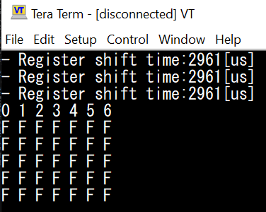
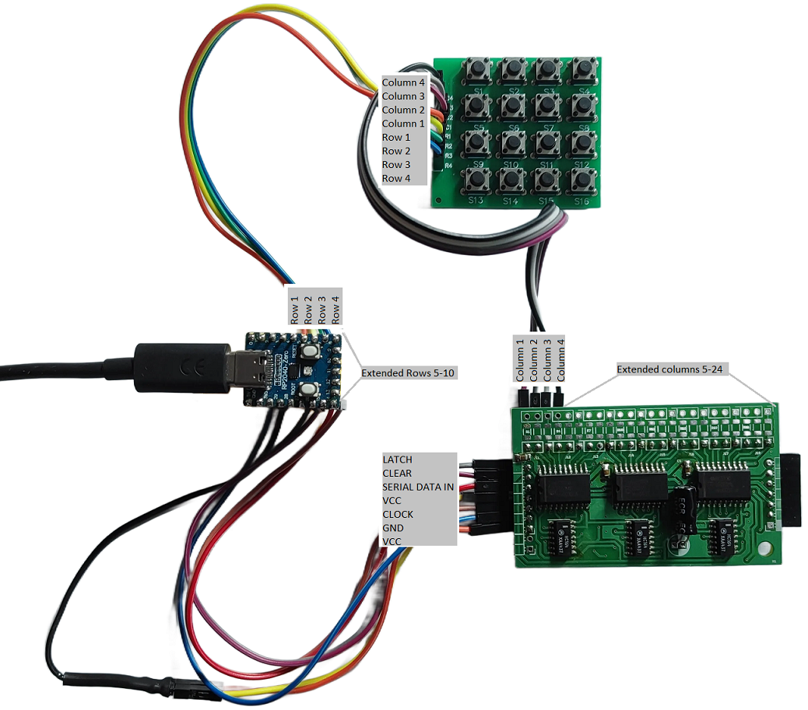
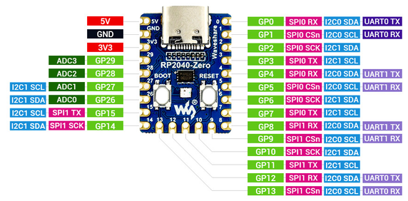
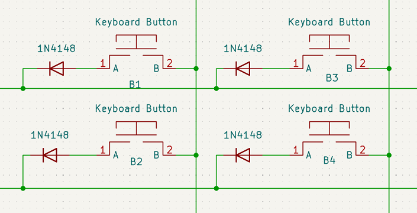
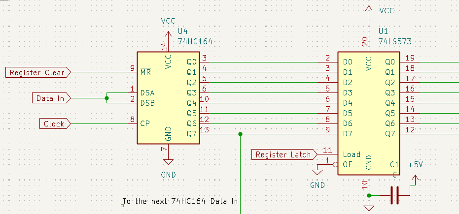
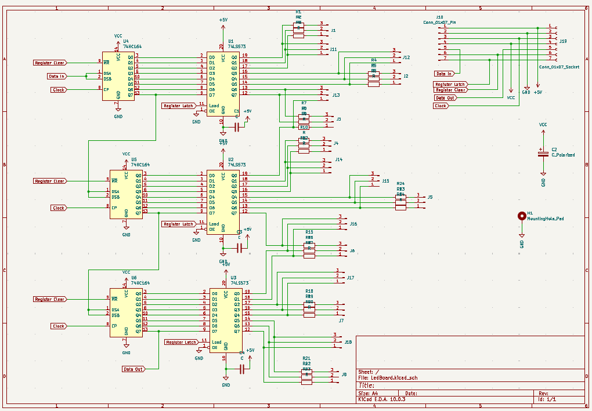

# Universal Button Matrix v1.0

UniversalButtonMatrix is a configurable Raspberry Pi Pico firmware for large button matrices. It leverages shift registers to expand button inputs while minimizing Raspberry Pi Pico GPIO usage.

The design uses only a few output pins to steer the shift registers and a small number of input pins to read back row state. For example, 4 output pins plus 1 input pin can scan any number of buttons because system scales by chaining additional shift register stages. This keeps the Pico's native GPIOs available for peripherals while supporting larger button arrays.

## Features

- Preconfigured button matrix supports 32, 64, and 128 buttons
- RP2040/Pico firmware configured as a USB HID controller (gamepad style)
- Optional host-side simulator/tester build via `HOST_BUILD`

## Firmware options

This firmware supports three build-time button matrix variants (easy to extend):
- `VARIANT_32_BUTTONS_ENABLED`
- `VARIANT_64_BUTTONS_ENABLED`
- `VARIANT_128_BUTTONS_ENABLED`

Exactly one variant must be enabled to set the matrix dimensions and HID report size. See [include/shiftregister.h](include/shiftregister.h#L1).

The 32-button variant has lower latency than the larger variants because it uses fewer shift-register-driven columns.

The 128-button variant is the maximum supported by the USB HID gamepad protocol used here. Larger matrix hardware can be scanned, but only 128 buttons can be reported over the USB HID descriptor.

`HOST_BUILD`
- When `HOST_BUILD=ON`, the project builds a PC-side tester instead of Pico firmware, enabling verification without physical hardware.

`CONSOLE_DEBUG`
Controls runtime debug output verbosity for the Pico build:
- `0`: no serial/CDC debug output
- `1`: minimal verbosity — displays core loop timing only, useful for latency diagnostics
- `2`: medium verbosity — shows a button-press console visualization

- `3`: maximum verbosity — reserved for future use


## Hardware application

Complete (example) hardware setup follows:



**About PicoBoard RP2040-Zero**



The software is designed primarily for PicoBoard RP2040-Zero, but it is easy to adapt to other Raspberry Pi compatible boards. The entire system is powered via the USB port (and uses the built-in 3.3V RP2040 power line)

Used pinouts:
| *RPi-GPIO* | *Assignment* |
| --- |---:|
| 29 | ANALOG AXIS X |
| 28 | ANALOG AXIS Y |
| 27 | LATCH |
| 26 | REGISTER CLEAR |
| 15 | SERIAL DATA OUTPUT |
| 14 | CLOCK |
| 4, 5, 6, 7, 8 | ROW 1-5 INPUT |
| 9, 10, 11, 12, 13 | ROW 6-10 INPUT |

**About matrix keyboard**

Matrix button layout with diodes is recommended:



**About shift register board**

Simple register board is based on two inexpensive devices 74HC164, 74LS573 and can be easily extended by repeating the pattern:



Keep in mind that more columns increase the serial data pipeline length. This adds RP2040 bit shifting and raises polling latency.

Example application:



Hardware package Schematic/PCB: [KiCad10 ShiftRegisters.zip](doc/ShiftRegisters.zip)

## Software Build

Build instructions for both x86 host testing and the Raspberry Pi Pico target.

### Prerequisites

- `cmake` 3.13 or newer
- Pico SDK installed and accessible via `PICO_SDK_PATH`
- `gcc-arm-none-eabi` toolchain for Pico builds, Download [gnu-toolchains-for-arm](https://gitlab.arm.com/tooling/gnu-toolchains-for-arm/-/tree/releases/14.3.rel1?ref_type=heads)
- Optional: Docker for containerized builds

### Project status

- Core Pico firmware and host simulator are implemented
- 32 / 64 / 128 button variants supported
- HID descriptor currently supports 9 axes only; 16-axis support is not implemented yet
- USB hardware integration and host simulator polishing are still in progress

**x86 (host) build — quick testing**

- Requirements: `cmake`, a C++ compiler (MSVC or GCC/MinGW).
- Configure and build the host test target:

```bash
cmake -S . -B build -DHOST_BUILD=ON -DCONSOLE_DEBUG=2 -DVARIANT_128_BUTTONS_ENABLED=ON 
cmake --build build --config Debug
./build/UniversalButtonMatrix_host.exe
```

- You can also use the included VS Code tasks and launch configs:
	- See [/.vscode/tasks.json](.vscode/tasks.json#L1) and [/.vscode/launch.json](.vscode/launch.json#L1).

**Raspberry Pi Pico build (variant 128 buttons support)**

- Requirements: `cmake`, Pico SDK. Set `PICO_SDK_PATH` to your Pico SDK location.
- Configure and build the UBM-Pico firmware:

```bash
mkdir build && cd build
PICO_SDK_PATH=/path/to/pico-sdk cmake -DVARIANT_128_BUTTONS_ENABLED=1 -DCONSOLE_DEBUG=0 -DCMAKE_BUILD_TYPE=Release ..
cmake --build .
```

If you prefer to pass the path as a CMake cache variable, the build now also supports:

```bash
cmake -DPICO_SDK_PATH=/path/to/pico-sdk -DVARIANT_128_BUTTONS_ENABLED=1 -DCONSOLE_DEBUG=0 -DCMAKE_BUILD_TYPE=Release ..
```

The final built UF2 file will appear as *UniversalButtonMatrix_128BTN.uf2*.

**Docker (Windows) build**

This repository includes a Dockerfile at `UBM-PicoBuild.dockerfile` for cross-platform Pico builds in Docker.

Build the Docker image from the repository root (Windows example):

```powershell
# PowerShell
docker build -f UBM-PicoBuild.dockerfile -t pico-build .
```

Run the container with the project mounted and build the UBM-Pico firmware:

```powershell
docker run --rm -v ${PWD}:/work -w /work pico-build -lc "rm -rf build && cmake -S . -B build -DHOST_BUILD=OFF -DPICO_SDK_PATH=/opt/pico-sdk -DVARIANT_128_BUTTONS_ENABLED=1 -DCONSOLE_DEBUG=0 -DCMAKE_BUILD_TYPE=Release && cmake --build build"
```

Notes:
- Update `UBM-PicoBuild.dockerfile` if you need a different Pico SDK version or toolchain.
- On Windows, ensure Docker has access to your drive when mounting volumes.

## Contributing

Contributions are welcome. Please open issues for bugs or feature requests, and submit pull requests for fixes and improvements.

## License

This project is licensed under the MIT License. See [LICENSE](LICENSE) for details.

## TODOs:
- Document that the USB descriptor implementation currently supports only 9 axes; 16-axis support is not implemented and hardware integration is still pending.
- Polish the PC-host build/system simulator, add more simulator functionality, and improve its integration with the actual hardware workflows.


